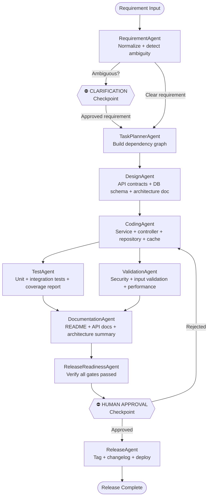
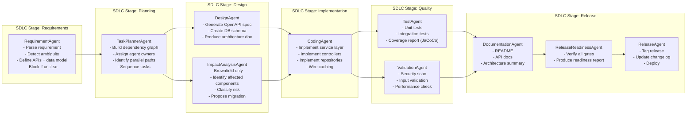
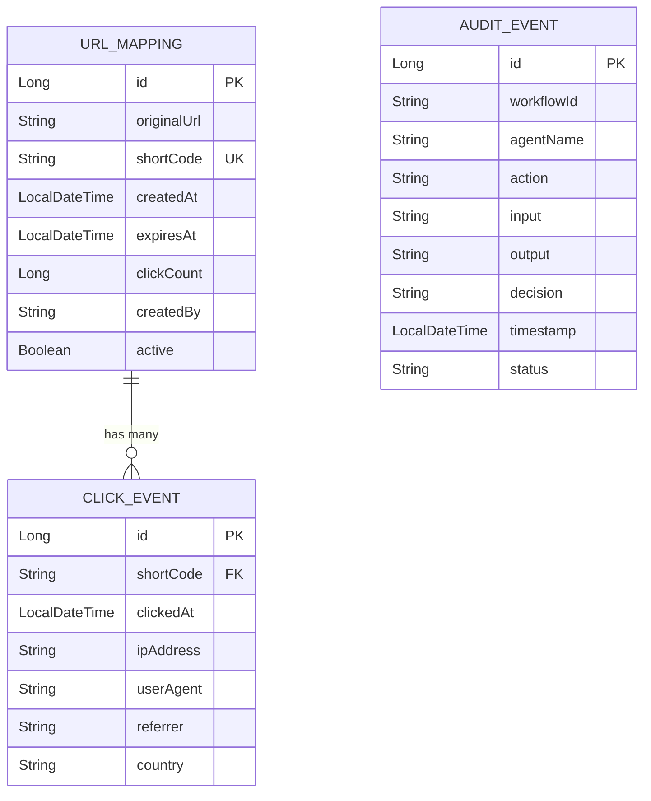
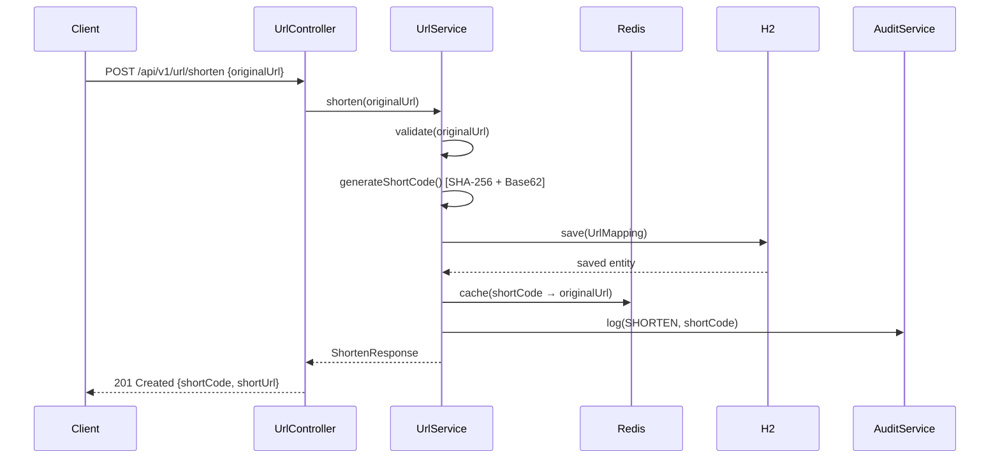
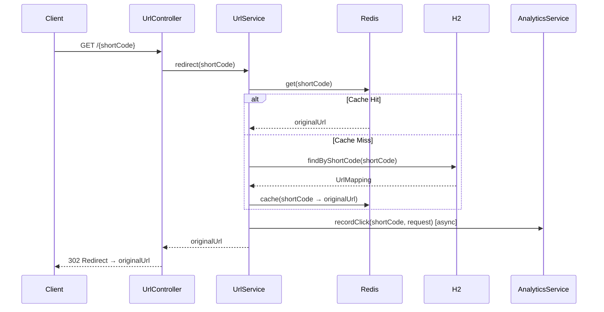
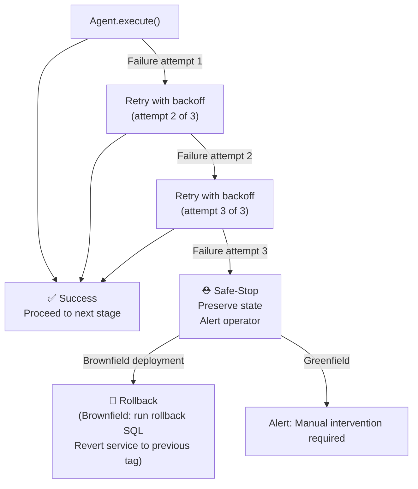

# Agentic URL Shortener — Architecture

This document describes the system architecture, component responsibilities, data flow,
agentic orchestration model, and key design decisions for the URL Shortener service.

---

## 1. High-Level System Architecture

```mermaid
graph TD
    Client["Client (Browser / API Consumer)"]

    Client -->|POST /api/v1/url/shorten| UrlController
    Client -->|GET /{shortCode}| UrlController
    Client -->|GET /api/v1/url/analytics/{code}| AnalyticsController
    Client -->|POST /api/v1/agent/run| AgentController

    subgraph Application Layer
        UrlController["UrlController"]
        AnalyticsController["AnalyticsController"]
        AgentController["AgentController"]
    end

    subgraph Service Layer
        UrlService["UrlService"]
        AnalyticsService["AnalyticsService"]
        AuditService["AuditService"]
    end

    subgraph Infrastructure
        RedisCache["Redis Cache\n(redirect fast path)"]
        H2DB["H2 Database\n(UrlMapping, ClickEvent)"]
    end

    subgraph Agentic Orchestration
        AgentOrchestrator["AgentOrchestrator\n(Workflow Engine)"]
    end

    UrlController --> UrlService
    AnalyticsController --> AnalyticsService
    AgentController --> AgentOrchestrator

    UrlService --> RedisCache
    UrlService --> H2DB
    UrlService --> AuditService
    AnalyticsService --> H2DB
    AnalyticsService --> AuditService
```

---

## 2. Agentic Orchestration Model

The `AgentOrchestrator` executes the SDLC pipeline as a directed dependency graph.
Agents run sequentially or in parallel based on task dependencies. Human approval
gates block execution at critical checkpoints.



---

## 3. Agent Responsibility Map



---

## 4. Data Model



---

## 5. Request Flow — URL Shortening



---

## 6. Request Flow — Redirect



---

## 7. Agent Retry and Rollback Policy



---

## 8. Package Structure

```
com.schwab.urlshortener
├── agent
│   ├── Agent.java                    ← Base agent contract (interface)
│   ├── AgentOrchestrator.java        ← Workflow engine + dependency graph
│   ├── AgentResult.java              ← Standardized agent output
│   ├── RequirementAgent.java         ← Requirement parsing + ambiguity detection
│   ├── TaskPlannerAgent.java         ← Dependency graph construction
│   ├── DesignAgent.java              ← API contract + schema generation
│   ├── CodingAgent.java              ← Implementation coordination
│   ├── ImpactAnalysisAgent.java      ← Brownfield impact classification
│   ├── TestAgent.java                ← Test generation + coverage reporting
│   ├── ValidationAgent.java          ← Security + performance validation
│   ├── DocumentationAgent.java       ← Doc generation
│   ├── ReleaseReadinessAgent.java    ← Gate verification + readiness report
│   └── ReleaseAgent.java             ← Deployment execution
├── audit
│   ├── AuditEvent.java               ← Audit record entity
│   ├── AuditService.java             ← Audit interface
│   └── AuditServiceImpl.java         ← Audit persistence implementation
├── controller
│   ├── UrlController.java            ← REST endpoints for URL operations
│   └── AnalyticsController.java      ← REST endpoints for analytics
├── service
│   ├── UrlService.java               ← URL shortening interface
│   ├── UrlServiceImpl.java           ← Shortening + redirect logic
│   ├── AnalyticsService.java         ← Analytics interface
│   └── AnalyticsServiceImpl.java     ← Click recording + query logic
├── entity
│   ├── UrlMapping.java               ← JPA entity: URL mapping
│   └── ClickEvent.java               ← JPA entity: per-click analytics
├── repository
│   ├── UrlMappingRepository.java     ← Spring Data JPA repository
│   └── ClickEventRepository.java     ← Spring Data JPA repository
├── dto
│   ├── ShortenRequest.java
│   ├── ShortenResponse.java
│   └── AnalyticsResponse.java
├── exception
│   ├── DuplicateUrlException.java
│   ├── ResourceNotFoundException.java
│   └── GlobalExceptionHandler.java   ← @ControllerAdvice
├── security
│   └── ...                           ← Security configuration
├── metrics
│   └── ...                           ← Custom metrics (Micrometer)
├── logging
│   └── ...                           ← Structured logging config
├── workflow
│   └── ...                           ← Workflow state management
└── config
    └── ...                           ← Redis, cache, Swagger config
```

---

## 9. Key Architecture Decisions

| Decision | Chosen Approach | Alternative Considered | Reason |
|----------|----------------|----------------------|--------|
| Short code generation | SHA-256 + Base62 (6 chars) | UUID, NanoID, sequential ID | Deterministic, collision-resistant, no DB round-trip for generation |
| Caching strategy | Redis with cache-aside | No cache, write-through | Cache-aside gives control; graceful degradation if Redis unavailable |
| Analytics write path | Async fire-and-forget | Synchronous write | Redirect p99 latency not blocked by analytics DB write |
| Database | H2 in-memory | PostgreSQL | Zero-config for prototype; schema is PostgreSQL-compatible |
| Workflow engine | In-memory state machine | Temporal, Camunda, Quartz | Demonstrates orchestration concepts without infrastructure overhead |
| Human approval | Synchronous blocking API call | Event-driven approval | Explicit, auditable; evaluator can trigger and observe the gate |
| Error handling | GlobalExceptionHandler + custom exceptions | Per-controller try/catch | Centralized, consistent error responses across all endpoints |
| Audit trail | Dedicated AuditService + AuditEvent entity | Application logs only | Queryable audit records; supports compliance and traceability requirements |
